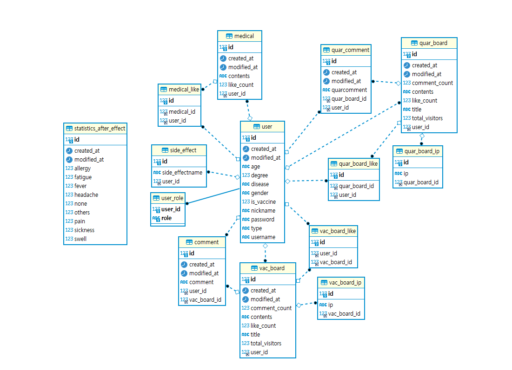

# 슬기로운 백신생활

### Description

- '슬기로운 백신생활'은 백신 접종 후기를 자유롭게 공유할 수 있는 커뮤니티 사이트입니다.
- '백신 후기 게시판', '격리 후기 게시판', '의료진분들께' 게시판에서 코로나 및 백신과 관련된 다양한 경험을 자유롭게 공유할 수 있도록 하는 것에 중점을 두었습니다.
- 데스크탑, 모바일 웹사이트  
  

### Team Members

- **Team Leader** 이윤정  
- **Front** 이원교, 이윤정, 연다은, 정효윤  
- **Back** 성찬우, 강지현, 남태현  
- **Designer** 지유정, 정주희, 이규동  
  
  
### Contact

- **Email** fitchan@naver.com 
- **Project Link** https://github.com/Vaccine-life  
  
  
### Stack

    React
    React Router Dom
    Redux
    React Redux
    Redux Toolkit
    lodash
    moment

    Spring-boot
    JPA
    hibernate
    MySQL
    Spring Security
    asciidoctor
  
  
### Environment 반응형 웹

    OS: Windows, Mac OS, Android, IOS  
    Browser support: Chrome, Safari  
  

  
### 협업 툴

Notion, Slack, Gather  
  
  
### 버전 관리

git, GitHub

### 아키텍처

### ERD 

### 시퀀스 

- 로그인

- 회원가입

- 백신 게시판 GetMapping

- 백신 게시판 PostMapping

- 백신 게시판 댓글 GetMapping

- 백신 게시판 댓글 PostMapping

[comment]: <> (TODO 최상단에 DOCS IMG 파일 넣어두고 끌어다 쓸수 있음을 확인 &#40;MARKDOWN 문서 만들기&#41; )

* :link:
### Rest Docs 바로가기(이미지를 클릭하시면 restDocs을 확인 하실수 있습니다.)

  
